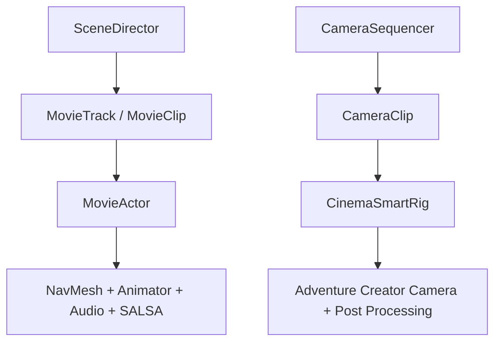
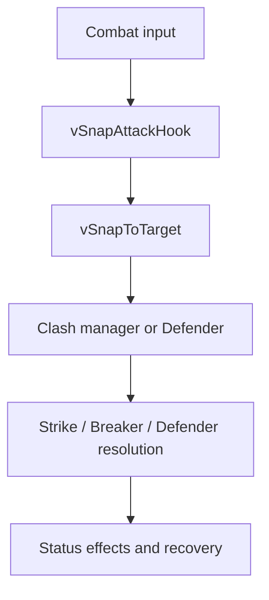

# Taek-Won-Cop Systems

Selected Unity/C# systems from **Taek-Won-Cop Turbo**, an action-RPG prototype by Kendall Angulo Jhonson.

This repository is a focused technical sample. It is not the complete game project and does not include commercial middleware, art, audio, scenes, or other third-party assets.

## Featured system: Director

The Director system coordinates character performance and cinematic cameras through data-driven tracks:

- `SceneDirector` starts cutscene control and runs each actor's action channels concurrently.
- `MovieData` defines serializable tracks and clips for movement, animation, dialogue, effects, and facial performance.
- `MovieActor` adapts those commands to navigation, animation, audio, SALSA lip sync, and emotes.
- `CameraSequencer` executes ordered shots, transitions, and restoration of the previous camera.
- `CinemaSmartRig` renders waypoint motion, focus, FOV, recoil, trauma, optical stress, and time scaling.
- `CameraData` defines the shot, motion, transition, focus, impact, and time-control data used by the rig.

## Featured system: Clash Snap

Clash Snap turns one attack input into a coordinated targeting, movement, skill-selection, defense, and status-resolution pipeline:

- `vSnapAttackHook` arbitrates mutually exclusive attack spaces: normal/Clash skill, Power Clash, Defender, and optional extra managers.
- `vSnapToTarget` selects a target from directional input, lock-on state, range, view angle, and line of sight, then performs a short controlled approach.
- `PlayerClashManager` selects available normal or context-sensitive special skills, manages runtime cooldowns, and exposes the active clash card.
- `PlayerClashDefender` resolves successful defense and guard-break outcomes while safely capturing and restoring player control state.
- `PlayerStatusEffectManager` applies Clash consequences, forced reactions, control locks, stat modifiers, VFX, and cleanup.
- `PlayerClashSkill` and `EnemyClashSkill` keep attack tuning in reusable `ScriptableObject` assets.

The full decision flow is documented in [`docs/clash-snap.md`](docs/clash-snap.md).

## Repository map

| Path | Responsibility |
| --- | --- |
| `src/Director/SceneDirector.cs` | Cutscene state and multi-track orchestration |
| `src/Director/MovieData.cs` | Serializable action and track definitions |
| `src/Director/MovieActor.cs` | Actor command adapter |
| `src/Director/CameraData.cs` | Cinematic shot configuration |
| `src/Director/CameraSequencer.cs` | Shot order, transitions, and camera handoff |
| `src/Director/CinemaSmartRig.cs` | Runtime camera motion, optics, impact, and time effects |
| `src/ClashSnap/` | Target snap, attack arbitration, Clash skills, defense, and player status effects |
| `docs/architecture.md` | Runtime flow and design decisions |
| `docs/clash-snap.md` | Clash Snap rules, sequence, and component responsibilities |
| `docs/dependencies.md` | Package boundaries and omitted project content |

## Technical boundaries

The sample references these Unity packages through their public APIs:

- Unity Engine, AI Navigation, and Post Processing Stack v2
- Adventure Creator
- Invector Third Person Controller
- SALSA LipSync Suite
- The original project's `MalbersAnimations.Cards` Clash contracts

Those packages are **not** redistributed here. See [`docs/dependencies.md`](docs/dependencies.md) for the file-by-file mapping.

## Current sample status

This is production-oriented prototype code extracted from a larger Unity project for code review. It demonstrates the architecture and integration work, but it is not intended to compile as a standalone Unity project without the listed packages and original scene setup.

The Director and Clash Snap source folders are coherent extracts from the original project. They still rely on the packages and project-level combat contracts listed in [`docs/dependencies.md`](docs/dependencies.md), so this repository remains a code-review sample rather than a standalone Unity project.

## Project links

- [Taek-Won-Cop case study](https://kendarte.github.io/projects/taek-won-cop/)
- [Kendall Angulo Jhonson — portfolio](https://kendarte.github.io/)

## Usage

Published for portfolio and technical-review purposes. See [`NOTICE.md`](NOTICE.md).
