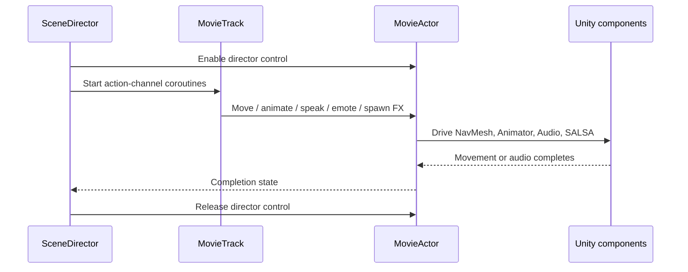
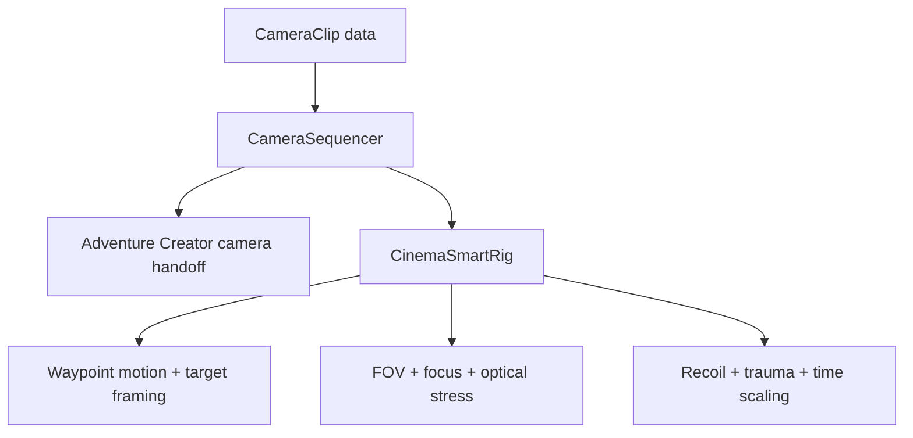

# Director architecture

## Purpose

The Director layer separates authored scene data from runtime execution. Designers configure serializable clips and tracks in Unity; the runtime components translate that data into actor and camera behavior.

## Actor pipeline

`SceneDirector` groups clips by channel. Movement, animation, dialogue, VFX, and emote channels can run in parallel, while clips inside each channel remain ordered. This allows a character to move and speak at the same time without turning the entire scene into one monolithic timeline.

`MovieActor` is the integration boundary. The director issues intent-level commands, while the actor component owns navigation, locomotion parameters, final facing, audio playback, facial performance, and effect attachment.

## Camera pipeline

`CameraSequencer` owns shot order and screen transitions. It remembers the previously active Adventure Creator camera, hands control to the cinematic rig, and restores the previous camera after the sequence.

`CinemaSmartRig` evaluates each shot with unscaled time so camera motion and transitions can continue during slow-motion effects. Camera position follows configured waypoints, orientation tracks the target, and the same normalized shot time drives lens, focus, recoil, trauma, and time-scale behavior.

## Design decisions demonstrated

- **Data-driven authoring:** shot and performance configuration lives in serializable clip objects.
- **Concurrent channels:** independent actor concerns can overlap without losing deterministic order inside each channel.
- **Adapter boundary:** middleware-specific calls are concentrated in actor and camera runtime components.
- **State restoration:** cutscene mode, camera ownership, time scale, and optical effects are explicitly restored.
- **Scene visualization:** camera waypoints and frustums are visible through Unity gizmos before runtime.

## Scope of this extract

The repository contains the central runtime files only. Custom Unity inspectors, scene objects, prefabs, animation controllers, audio, dialogue content, and commercial middleware are outside this extract.
