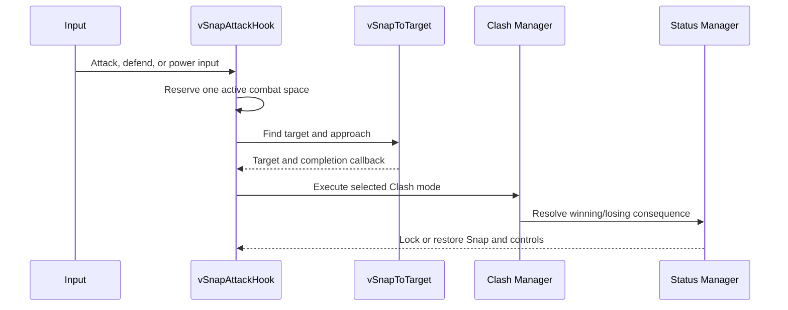

# Clash Snap architecture

## Purpose

Clash Snap joins free-direction target acquisition with a category-based combat resolution layer. The player can approach a selected enemy, execute a normal or context-sensitive skill, defend, or use a separate Power Clash arsenal without those inputs fighting over the same animation and control state.

## Runtime sequence

## Target selection

`vSnapToTarget` scores candidates in this order:

1. Read camera-relative directional input.
2. Reuse the Invector lock-on target when directional input is not requesting a target change.
3. Otherwise scan colliders inside the configured range.
4. Collapse multi-collider enemies to their `StatusC` root.
5. Reject targets outside the enemy tags, range, search cone, or line of sight.
6. Score the remaining targets by distance plus angular deviation.

During the approach, the component temporarily disables the `CharacterController`, locks Invector movement and rotation, moves along an easing curve, faces the target, and restores the captured controller state before invoking the attack callback.

## Input arbitration

`vSnapAttackHook` maintains one active space so incompatible actions do not start simultaneously.

| Space | Entry point | Runtime action |
| --- | --- | --- |
| Defender | Defense input | Hold position or snap first, then begin `PlayerClashDefender` |
| ClashSkill | Primary attack | Use `PlayerClashManager` when enabled; otherwise fire Animator triggers |
| PowerClash | Power input | Use an independent `PlayerPowerClashManger` arsenal |
| Additional | Configured extra input | Dispatch to a selected additional Clash manager |

The hook also owns short cooldown gating, optional temporary/external locks, attack timing before or after the snap, aura visibility, and Unity events for presentation hooks.

## Skill selection

`PlayerClashManager` evaluates context-sensitive special skills before normal skills. A special becomes eligible when its configured enemy and/or player status requirements are satisfied and its runtime cooldown is ready. If no special qualifies, the manager randomly chooses from the available normal skills.

The selected `PlayerClashSkill` is copied into a runtime `ClashCardTemplate`, keeping the active attack compatible with the project's shared Clash resolver while the animation, anticipation, VFX, duration, and cooldown remain owned by the player manager.

## Clash rules

| Incoming relationship | Outcome represented in this extract |
| --- | --- |
| Defender receives Strike | Status is nullified, the projectile can be removed, and the attacker receives the configured punish status |
| Defender receives Breaker | Defense is ended, invulnerability is bypassed, optional bonus damage is applied, and Guard Break status can be forced |
| Breaker receives Strike | The active attack is cancelled and the Breaker receives the configured punish status |

The shared `UniversalClashManager`, projectile metadata, enemy status managers, and base RPG status components belong to the larger project and are therefore documented but not duplicated in this repository.

## Status lifecycle

`PlayerStatusEffectManager` owns named effect definitions and their active coroutines. An effect can:

- interrupt existing effects;
- lock movement, rotation, and Snap input;
- force an animation;
- apply knockback or knock-up;
- grant temporary invulnerability;
- change attack or defense statistics;
- attach a VFX for the effect lifetime.

Cleanup removes the coroutine and VFX, restores statistics, recalculates control/Snap locks from the effects still active, and avoids restoring gameplay state after player death.

## Integration boundary

This folder is the player-facing portion of a larger combat architecture. It intentionally references project contracts and middleware APIs rather than copying them. See [`dependencies.md`](dependencies.md) for the exact boundary.
